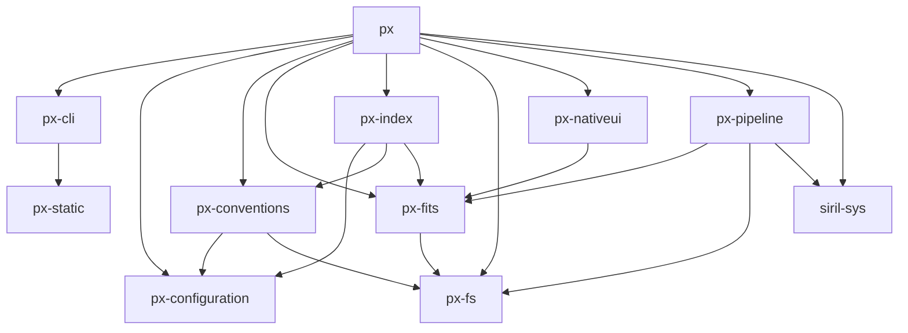

# Crate Dependency Graph

This document shows how the `px-*` crates (and `siril-sys`) depend on each other within the workspace.

## Graph

## Dependency Table

| Crate | Depends On |
|---|---|
| `px` | `px-cli`, `px-configuration`, `px-conventions`, `px-fits`, `px-fs`, `px-index`, `px-nativeui`, `px-pipeline`, `siril-sys` |
| `px-cli` | `px-static` |
| `px-conventions` | `px-configuration`, `px-fs` |
| `px-fits` | `px-fs` |
| `px-index` | `px-configuration`, `px-conventions`, `px-fits` |
| `px-nativeui` | `px-fits` |
| `px-pipeline` | `px-fits`, `px-fs`, `siril-sys` |
| `px-configuration` | *(none)* |
| `px-fs` | *(none)* |
| `px-static` | *(none)* |
| `siril-sys` | *(none)* |

## Leaf Crates (no internal dependencies)

- `px-configuration` — project/workspace config types
- `px-fs` — filesystem utilities
- `px-static` — static assets / embedded resources
- `siril-sys` — FFI bindings to Siril
